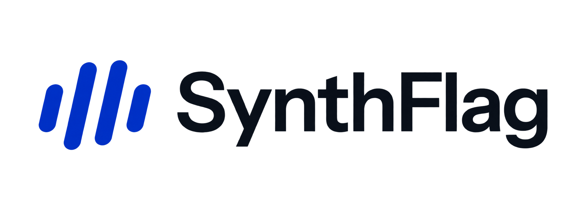

<p align="center">
  
</p>

# SynthFlag

**SynthFlag** is the TikTok TechJam 2026 submission for detecting AI-generated
images in real-world collections. It packages the research-grade FeatDistill
four-expert detector into a reproducible inference workflow with protected
evaluation, checkpoint integrity checks, and submission-facing evidence.

FeatDistill remains the name of the underlying detector architecture and
research lineage. SynthFlag is the public product, submission, Python
distribution, and primary CLI name.

## Submission package

- [Submission overview](submission/README.md)
- [Benchmark table](submission/BENCHMARKS.md)
- [Architecture diagram and explanation](submission/ARCHITECTURE.md)
- [Exact reproduction commands](submission/REPRODUCE.md)
- [Artifact checksums](submission/ARTIFACTS.sha256)
- [Model card](submission/MODEL_CARD.md)
- [Dataset attribution and rights](submission/DATASETS_AND_RIGHTS.md)
- [Third-party notices](submission/THIRD_PARTY_NOTICES.md)
- [Release audit](submission/RELEASE_AUDIT.md)
- [Project status and worktree register](STATUS.md)

## Benchmark snapshot

The protected V1 final partition contains 7,998 images: 3,999 real and 3,999
fake. The recommended balanced operating point changes only the frozen decision
threshold; it does not retrain the detector or change its ranking.

| Configuration | ROC-AUC | Balanced accuracy | F1 | Fake recall | Precision | Specificity |
|---|---:|---:|---:|---:|---:|---:|
| Released mean, threshold 0.5 | 0.8505 | 0.7763 | 0.7259 | 0.5924 | 0.9371 | 0.9602 |
| **SynthFlag balanced point, threshold 0.2874746155** | **0.8505** | **0.8061** | **0.7861** | **0.7127** | 0.8764 | 0.8995 |

The complete table separates protected V1 results, retrospective V2
development evidence, and blocked V3 fields. See
[submission/BENCHMARKS.md](submission/BENCHMARKS.md) for the evidence boundary
and unavailable values.

## How it works


Two CLIP experts process 224 px inputs and two SigLIP experts process 384 px
inputs. Each returns a fake-image probability. The released inference path
averages the four probabilities into a single score from 0 to 1. SynthFlag's
balanced operating point applies the calibration-frozen threshold
`0.2874746155` to that unchanged score.

## Quick start

Python 3.10 or newer is required. When using CUDA, install a PyTorch build that
matches the local driver.

```bash
python -m venv .venv
source .venv/bin/activate
python -m pip install --upgrade pip
python -m pip install -e .
```

Download the four released expert checkpoints and place them directly in
`weights/`. Their expected sizes and SHA-256 digests are recorded in
[`weights/manifest.json`](weights/manifest.json).

```bash
synthflag-infer \
  --images-dir /path/to/images \
  --out-dir outputs/predictions \
  --weights-dir weights \
  --device auto
```

`python -m infer` and the legacy `featdistill-infer` command remain available
for compatibility with the underlying detector release.

The command recursively reads JPEG, PNG, BMP, WebP, and TIFF images and writes
`predictions.csv` plus `predictions.meta.json`. Runs are resumable; an exclusive
output lock prevents concurrent writers from corrupting the CSV.

## Demo

[Open the live SynthFlag landing page](https://synthflag.chaipinzheng353496.chatgpt.site/)
or [open the image-testing experience](https://synthflag.chaipinzheng353496.chatgpt.site/try).
Both routes are public. The hosted `/try` route provides the complete file-drop
interface and reports whether a checkpoint-backed model service is connected;
use the local service below for executable scoring when the public worker is not
connected.

```bash
python -m pip install -e ".[server]"
export SYNTHFLAG_WEIGHTS_DIR=/absolute/path/to/weights
export SYNTHFLAG_EAGER_LOAD=1
uvicorn service.app:app --host 127.0.0.1 --port 8000
```

In another terminal:

```bash
cd landing-page
cp .env.example .env.local
pnpm install
pnpm dev
```

Open `http://localhost:3000/try`. The interface accepts one JPEG, PNG, or WebP
image up to 10 MB and displays the ensemble's continuous `P(AI-generated)`
score. It does not persist uploaded bytes or results. See `service/README.md`
for the production GPU and origin-allowlisting contract.

The landing page keeps browser-native scrolling and uses GSAP ScrollTrigger as
a progressive enhancement for reveals and desktop parallax. Lenis and other
virtual-scroll layers are intentionally excluded.

## Reproduce the evidence

The full benchmark commands, environment checks, expected inputs, verification
steps, and evidence limitations are in
[submission/REPRODUCE.md](submission/REPRODUCE.md). Dataset-derived rows,
individual scores, local paths, and protected data are intentionally excluded
from the public package.

## Research and responsibility

SynthFlag builds on FeatDistill, the UESTC solution for the NTIRE 2026
Challenge on Robust AI-Generated Image Detection in the Wild. The hackathon
integration, reproducibility layer, evidence package, and product presentation
are the submission work; the detector architecture and released checkpoints
must retain their upstream attribution.

Underlying detector report: [FeatDistill, arXiv:2603.21939](https://arxiv.org/abs/2603.21939).

A SynthFlag score is a signal, not conclusive proof of an image's origin.
Decisions with real consequences should include human review and supporting
evidence.

Please cite the challenge report when using the detector or checkpoints:

```bibtex
@inproceedings{gushchin2026ntire,
  title     = {NTIRE 2026 Challenge on Robust AI-Generated Image Detection in the Wild},
  author    = {Gushchin, Aleksandr and others},
  booktitle = {Proceedings of the IEEE/CVF Conference on Computer Vision and Pattern Recognition Workshops},
  pages     = {1895--1913},
  year      = {2026}
}
```

[arXiv:2604.11487](https://arxiv.org/abs/2604.11487) ·
[CVPR 2026 Open Access](https://openaccess.thecvf.com/CVPR2026_workshops/NTIRE)

## Release and licensing

Repository code and original project documentation are provided under the
[Apache License 2.0](LICENSE). That license does **not** grant rights to
third-party model checkpoints, datasets, benchmark images, dependency code, or
trademarks.

This Git repository intentionally excludes the four fine-tuned checkpoints,
dataset pixels, private split rows, and per-image protected-evaluation scores.
The checkpoint mirror is an external source, not a redistribution grant. Read
the [model card](submission/MODEL_CARD.md),
[dataset and rights inventory](submission/DATASETS_AND_RIGHTS.md),
[third-party notices](submission/THIRD_PARTY_NOTICES.md), and
[release audit](submission/RELEASE_AUDIT.md) before packaging or redistributing
anything beyond this source tree.
