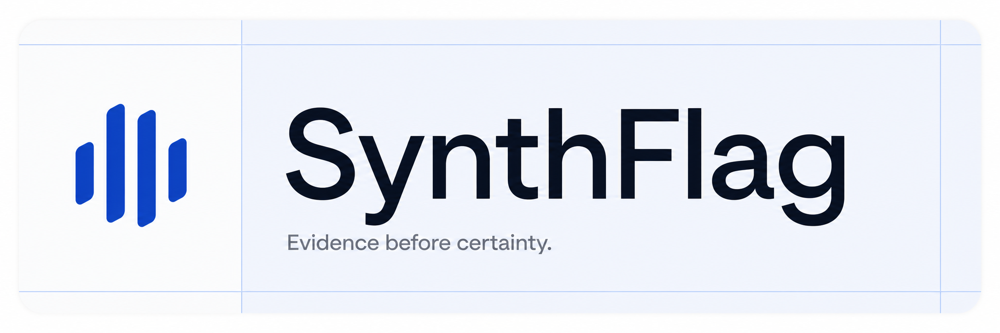
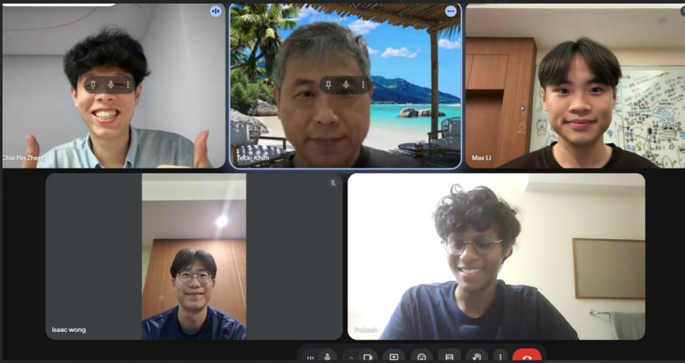
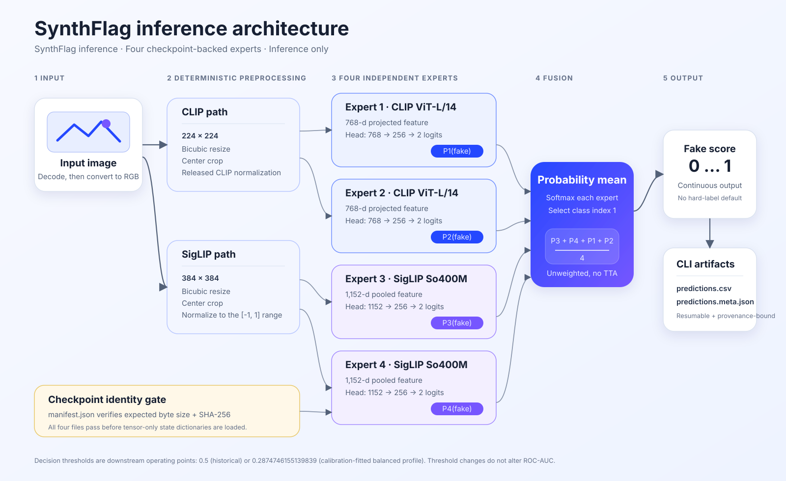

<P>NOTE<P>

<P>THE 4 LAYERS WEIGHTS ENSEMBLE AND 1 FINETUNED HEAD (you can pick any one of the heads all of them give relatively similar results) IS HERE - https://drive.google.com/drive/folders/1YPth1je92IaucRu3f8y50oxlAPcMqXuL?usp=sharing</P>

<P>We prioritized false-positive control during operating-point and stack selection because incorrectly flagging authentic content can harm creators. We then improved recall within that constraint. This is an operational priority, not a claim that false positives are universally low.<P>

<p align="center">
  <picture>
    <source media="(prefers-color-scheme: dark)" srcset="assets/brand/synthflag/17-dark-readme-hero.png">
    <source media="(prefers-color-scheme: light)" srcset="assets/brand/synthflag/16-light-readme-hero.png">
    
  </picture>
</p>

<h1 align="center">SynthFlag</h1>

<p align="center">
  Robust AI-generated image detection with reproducible inference and evidence-aware reporting.<br>
  Built for the <strong>TikTok TechJam 2026 Hackathon</strong> around our three trained residual heads, deterministic routing, and TEST1 evaluation stack.
</p>

<p align="center">
  <a href="https://synthflag.chaipinzheng353496.chatgpt.site/"><strong>Live demo</strong></a> ·
  <a href="https://youtu.be/X5-J4NmNHl0"><strong>Demo video</strong></a> ·
  <a href="https://synthflag.chaipinzheng353496.chatgpt.site/try">Try the current detector</a> ·
  <a href="https://synthflag.chaipinzheng353496.chatgpt.site/journey">Project journey</a> ·
  <a href="https://synthflag.chaipinzheng353496.chatgpt.site/documentation">Documentation</a> ·
  <a href="submission/BENCHMARKS.md">Benchmarks</a> ·
  <a href="submission/REPRODUCE.md">Reproduce</a>
</p>

<p align="center">
  <code>Python ≥ 3.10</code> · <code>Apache-2.0 source</code> · <code>SigLIP Expert 4</code> · <code>3 residual heads</code>
</p>

## Overview

**SynthFlag** provides our selected TEST1 detector graph—three project-trained
residual heads, deterministic native-size routing, and a frozen Expert 4
representation—inside a complete
TikTok TechJam workflow: verified batch inference, a public detector
experience, protected evaluation, and a submission package whose claims remain
traceable to their evidence.

SynthFlag is the public product, submission, Python distribution, and primary
CLI name. Our `training_eval/` package is authoritative for head training,
augmentation, routing, TEST1 evaluation, and the final checkpoint identities.
The frozen Expert 4 dependency retains its required upstream attribution.

### Highlights

- **Selected TEST1 graph:** native images at most 64 px use a CIFAKE-specialist
  residual head; larger images use a fixed `0.65 / 0.35` two-head stack over the
  same frozen Expert 4 feature and teacher margin.
- **Project model-development stack:** checked-in training and evaluation code,
  configs, tests, raw public TEST1 predictions, bootstrap evidence, figures,
  and hash-pinned identities for the final Google Drive checkpoint release.
- **Reliable batch inference:** recursive image discovery, resumable outputs,
  checkpoint integrity verification, and an exclusive writer lock.
- **Auditable robustness inputs:** an optional, sample-keyed augmentation
  toolkit produces deterministic RGB variants and JSON-ready transform traces.
- **Evidence before certainty:** benchmark, calibration, and deployment claims
  are separated; unavailable evidence stays unavailable instead of being
  inferred or filled in.
- **Product-ready surfaces:** Python API, CLI, optional FastAPI service, public
  landing page, image and sampled-video source experience, and technical
  documentation.

## Demos

- [Open the SynthFlag landing page](https://synthflag.chaipinzheng353496.chatgpt.site/)
- [Watch **SynthFlag demo v8** on YouTube](https://youtu.be/X5-J4NmNHl0)
- [Open the current `/try` deployment](https://synthflag.chaipinzheng353496.chatgpt.site/try)
- [Follow the project journey](https://synthflag.chaipinzheng353496.chatgpt.site/journey)
- [Read the visual documentation](https://synthflag.chaipinzheng353496.chatgpt.site/documentation)
- [Open the selected architecture section](https://synthflag.chaipinzheng353496.chatgpt.site/documentation#architecture)

The YouTube link is the recorded product demo. The source `/try` route provides
the complete image and sampled-video file-drop
experience and reports whether a checkpoint-backed model service is connected.
The hosted route reflects the latest deployed saved version, so verify its
health capability before claiming video is live. It never fabricates a score
when the public worker is unavailable. Use the local service setup below for
executable checkpoint-backed scoring.

## Benchmark snapshot

TEST1 evaluates 15,000 unique public images once clean and once with a
deterministic composite corruption, producing 30,000 selected-graph scores.
It is a public development diagnostic, not TikTok's hidden test.

| Dataset | Clean AUC | Composite AUC | Clean FP/FN | Composite FP/FN |
|---|---:|---:|---:|---:|
| CIFAKE | 0.9816 | 0.9095 | 288 / 113 | 499 / 388 |
| SID-Set | 0.8691 | 0.8439 | 18 / 1,044 | 58 / 1,038 |
| WildFake | 0.9467 | 0.8785 | 316 / 272 | 861 / 257 |

For TikTok-like creator operations, SynthFlag constrains false positives
first, then works to reduce false negatives within that constraint. A false
positive can wrongly question authentic work, interrupt distribution or
monetization, and create an appeal. TEST1 therefore reports TPR at 1% and 5%
FPR alongside ROC-AUC. Its fixed `0.5` point is diagnostic, not a universal
moderation cutoff; any consequential threshold needs representative
calibration, slice monitoring, human review, and an appeals path.

The complete [benchmark table](submission/BENCHMARKS.md) records TEST1 limits
and keeps the older four-expert V1/V2 studies explicitly historical. The
`<=64` route is benchmark-aware. The project owner accepts the collaborator's
attestation that the residual heads and their training inputs are rights-cleared
for project use; that attestation was not independently license-audited here.

### Day 3 research interview



The SynthFlag team [interviewed Professor Ng Teck Khim](docs/INTERVIEW_PROF_NG.md)
on Day 3. His discussion of Bayer sampling and demosaicing motivated us to
explore local variance, cross-channel relationships, mosaic phase, and
acquisition consistency as a future camera-forensics direction. With little
sprint time remaining, the early prototype was not strong or stable enough for
final use. It did not enter the selected runtime, TEST1, model selection, or
final claims, and the interview is not performance evidence or an endorsement.

## Architecture



Expert 4 supplies a 1,152-dimensional pooled feature and two-logit teacher
margin. Native longest side `<=64` uses the specialist head at alpha `1.25`;
larger images blend epoch-05 and epoch-08 corrected margins `0.65 / 0.35` and
apply the frozen boundary `-1.557959395647049` before sigmoid.

Read the [architecture explanation](submission/ARCHITECTURE.md), follow the
[project and decision journey](https://synthflag.chaipinzheng353496.chatgpt.site/journey),
or open the
[selected-model walkthrough](https://synthflag.chaipinzheng353496.chatgpt.site/journey#selected-model).

## Quick start

### 1. Install

Python 3.10 or newer is required. When using CUDA, install a PyTorch build that
matches the local driver.

```bash
python -m venv .venv
source .venv/bin/activate
python -m pip install --upgrade pip
python -m pip install -e .
```

### 2. Add checkpoints

Download the final three-head bundle and Expert 4 checkpoint from the team
Google Drive links in [`weights/README.md`](weights/README.md), then place the
four extracted files in `weights/`:

```text
weights/
├─ Expert_4_siglip.pth
├─ cifake_router_head.pt
├─ general_epoch05_head.pt
└─ general_epoch08_head.pt
```

No checkpoint bytes are tracked in Git. Expected filenames, sizes, SHA-256
digests, and Drive locations are recorded in
[`infer/checkpoint_manifest.json`](infer/checkpoint_manifest.json); runtime
verification rejects mismatched downloads.

### 3. Run inference

```bash
synthflag-infer \
  --images-dir /path/to/images \
  --out-dir outputs/predictions \
  --weights-dir weights \
  --device auto
```

`python -m infer` invokes the same SynthFlag CLI.

## Output contract

The CLI recursively reads JPEG, PNG, BMP, WebP, and TIFF files and creates:

```text
outputs/predictions/
├─ predictions.csv
├─ predictions.json
└─ predictions.meta.json
```

```csv
image_name,score
collection/example.jpg,0.873421
```

The completed run also writes the Track 5 submission format:

```json
[
  {
    "image_path": "collection/example.jpg",
    "pred": 0.873421
  }
]
```

- `image_name` is a POSIX-style path relative to `--images-dir`.
- `score` is the continuous routed-detector output in the range `[0, 1]`.
- `predictions.json` mirrors the completed CSV as `image_path` / `pred`
  records for the TikTok TechJam evaluator.
- `predictions.meta.json` binds resumable output to its input root and weight
  manifest.
- Rerun the same command to resume, or pass `--overwrite` to begin again.

If input bytes change while filenames stay the same, use a new output directory
or `--overwrite` so old and new predictions are never mixed.

## Optional augmentation toolkit

`synthflag_augment` is a repository-authored development utility for building
reproducible robustness inputs. It is not imported by inference and does not
reconstruct the paper-described training policy.

```python
from PIL import Image

from synthflag_augment import robustness_recipe

source = Image.open("example.png")
result = robustness_recipe(seed="study-v1").apply(
    source,
    sample_key="dataset/example.png",
)
result.image.save("example-augmented.png")
print(result.manifest)
```

Under the pinned dependencies, the same seed, recipe, and sample key produce
the same pixels without changing Python's global random state. Each result
records applied and skipped steps, resolved strengths, operation parameters,
and a stable pipeline identifier. The inventory includes practical repost,
compression, motion, screen-capture, color/exposure, and sensor-noise families
without restoring the historical upstream distortion package. See the
[augmentation toolkit guide](docs/AUGMENTATION_TOOLKIT.md) for the transform
inventory and protected-evaluation boundary.

## Local detector experience

Install the optional service dependencies and start the checkpoint-backed API:

```bash
python -m pip install -e ".[server]"
export SYNTHFLAG_WEIGHTS_DIR=/absolute/path/to/weights
export SYNTHFLAG_EAGER_LOAD=1
uvicorn service.app:app --host 127.0.0.1 --port 8000
```

In another terminal:

```bash
cd landing-page
cp .env.example .env.local
pnpm install
pnpm dev
```

Open `http://localhost:3000/try`. Image mode accepts one JPEG, PNG, or WebP up
to 10 MB and displays the continuous `P(AI-generated)` score. Video mode accepts
a 1–10 second H.264 MP4 or browser-supported WebM up to 50 MB, extracts eight
uniform midpoint frames locally, and displays ordered frame scores with mean,
peak, and threshold-count summaries. The raw video is never uploaded; only
lossless 384 × 384 PNG center crops are sent for in-memory scoring. The video
summary is descriptive—not audio or motion analysis, provenance proof, or a
calibrated probability that the video is AI-generated. See
[`service/README.md`](service/README.md) for the production GPU, health-check,
bounded-queue, and origin-allowlisting contract.

## Repository structure

```text
.
├─ training_eval/  # Authoritative model development, bundle identity, TEST1
├─ infer/          # Product adapter and resumable batch CLI
├─ synthflag_augment/ # Optional deterministic development-data augmentation
├─ service/        # Optional FastAPI inference service
├─ landing-page/   # Public website, detector UI, and visual documentation
├─ submission/     # Benchmarks, model card, checksums, and release audit
├─ docs/           # Project context and research references
├─ assets/         # Approved SynthFlag identity and evidence graphics
└─ weights/        # Drive download and local checkpoint setup guidance
```

## Submission package

- [Submission overview](submission/README.md)
- [Benchmark table](submission/BENCHMARKS.md)
- [Architecture diagram and explanation](submission/ARCHITECTURE.md)
- [Exact reproduction commands](submission/REPRODUCE.md)
- [Artifact checksums](submission/ARTIFACTS.sha256)
- [Model card](submission/MODEL_CARD.md)
- [Dataset attribution and rights](submission/DATASETS_AND_RIGHTS.md)
- [Third-party notices](submission/THIRD_PARTY_NOTICES.md)
- [Release audit](submission/RELEASE_AUDIT.md)
- [Devpost thumbnail](submission/media/synthflag-devpost-thumbnail.png)
- [Project status and release gates](STATUS.md)

## Documentation and AI context

- [Documentation hub](docs/README.md)
- [Prompt-ready project context](docs/AI_CONTEXT.md)
- [Prompting guide for teammates](docs/PROMPTING_GUIDE.md)
- [Repository instructions for coding agents](AGENTS.md)
- [Repository-authored augmentation toolkit](docs/AUGMENTATION_TOOLKIT.md)
- [Expert 4 detector report — Tu et al., arXiv:2603.21939](https://arxiv.org/abs/2603.21939)
- [NTIRE challenge report](https://arxiv.org/abs/2604.11487)

For a fast handoff, give an AI assistant `docs/AI_CONTEXT.md`. Add the primary
papers for method details, complete challenge context, other team methods,
official results, or citations.

## Reproduce the evidence

The full benchmark commands, environment checks, expected inputs, verification
steps, and evidence limitations are in
[`submission/REPRODUCE.md`](submission/REPRODUCE.md). Dataset pixels, local
paths, and private or protected individual scores are intentionally excluded;
the complete public-development TEST1 prediction record is included.

## Hackathon reflection

The hardest part was not producing another headline accuracy number; it was
keeping every claim attached to the split and experiment that supports it.
TEST1 is therefore labeled as a public development diagnostic, while the older
four-expert studies remain historical and V3 remains blocked.

We also learned that robustness is conditional. Compression, resizing, and
screenshot-like transformations affect datasets differently, while a lower
threshold improves fake recall by accepting more false positives. That is why
SynthFlag exposes a continuous score, documents the operating point, and treats
the output as review evidence rather than an automatic verdict.

Given more time, we would deploy a durable GPU-backed public inference worker,
evaluate the frozen detector on the exact organizer validation source once it
is legitimately available, expand representative error slices, and add an
abstention policy for uncertain or unfamiliar domains.

## Research, citation, and responsible use

SynthFlag builds on the released Expert 4 detector checkpoint. Expert 4 and its
teacher head retain upstream attribution; the three residual heads, native-size
router, evaluation harness, integration, and product are project work.
Dependency, checkpoint, and source licensing details are kept in the
[third-party notices](submission/THIRD_PARTY_NOTICES.md).

Underlying detector report: [arXiv:2603.21939](https://arxiv.org/abs/2603.21939).

A SynthFlag score is a signal, not conclusive proof of an image's origin,
generator identity, or manipulated region. Decisions with real consequences
should include human review and supporting evidence.

Please cite the challenge report when using the detector or checkpoints:

```bibtex
@inproceedings{gushchin2026ntire,
  title     = {NTIRE 2026 Challenge on Robust AI-Generated Image Detection in the Wild},
  author    = {Gushchin, Aleksandr and others},
  booktitle = {Proceedings of the IEEE/CVF Conference on Computer Vision and Pattern Recognition Workshops},
  pages     = {1895--1913},
  year      = {2026}
}
```

[arXiv:2604.11487](https://arxiv.org/abs/2604.11487) ·
[CVPR 2026 Open Access](https://openaccess.thecvf.com/CVPR2026_workshops/NTIRE)

## License and distribution

Repository code and original project documentation are provided under the
[Apache License 2.0](LICENSE). That license does **not** grant rights to
third-party model checkpoints, datasets, benchmark images, dependency code, or
trademarks.

This Git repository intentionally excludes all checkpoint binaries and
archives, dataset pixels, private split rows, and per-image protected-evaluation
scores. The hash-pinned team Google Drive release is the final checkpoint
distribution source. Git includes the public TEST1 row-level evaluation record.
The artifact links are external sources, not redistribution grants. The heads
carry a collaborator rights-clearance attestation accepted by the project owner.
That attestation does not clear redistribution of upstream Expert 4 or establish
organizer eligibility. Read
the [model card](submission/MODEL_CARD.md),
[dataset and rights inventory](submission/DATASETS_AND_RIGHTS.md),
[third-party notices](submission/THIRD_PARTY_NOTICES.md), and
[release audit](submission/RELEASE_AUDIT.md) before packaging or redistributing
anything beyond this source tree.
